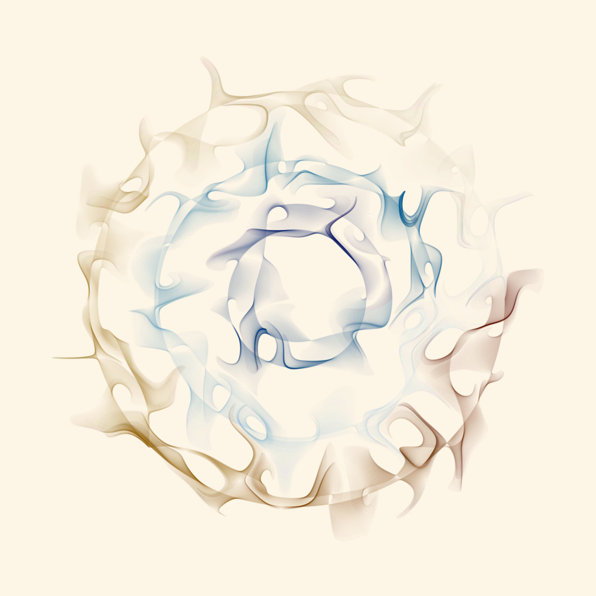
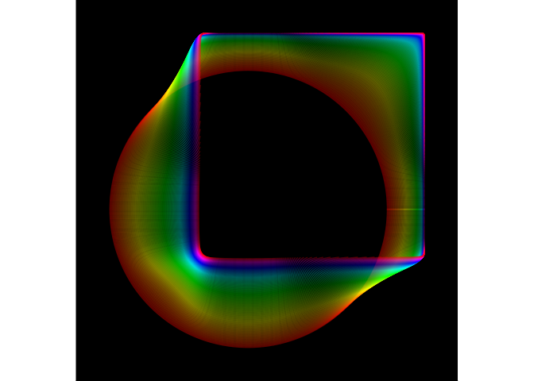
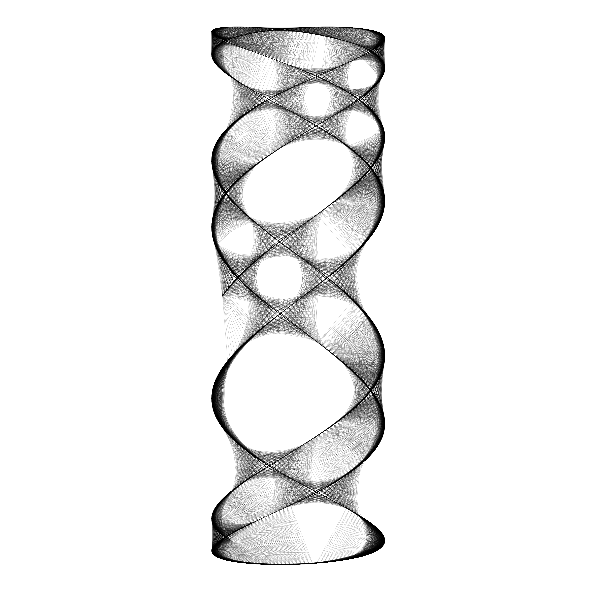
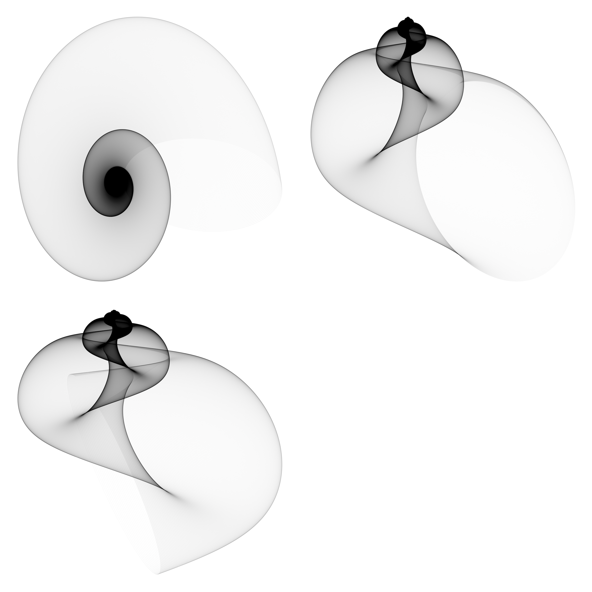
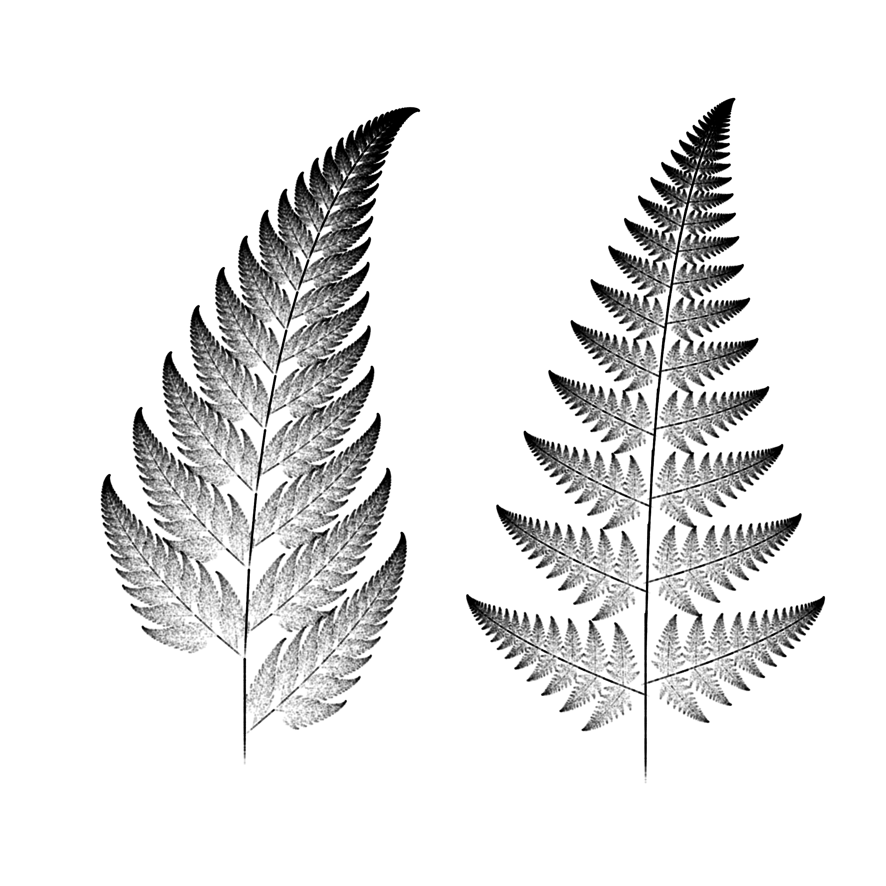

## Similar Packages{.tabset}

Generative art has been around since the term was coined in the 1960s, and over the years the creative process has had implementations across different languages and packages. 

In the R language specifically, two packages of note are: 

* [jasmines](https://github.com/djnavarro/jasmines)
* [mathart](https://github.com/marcusvolz/mathart)

### Jasmines 

```{r, eval=FALSE, echo=TRUE, warning=FALSE, message=FALSE}
# Packages needed
install.packages("remotes")
remotes::install_github("thomasp85/ambient")
remotes::install_github("djnavarro/jasmines")

# Get libraries going
library(dplyr)
library(jasmines)

# Source code: https://github.com/djnavarro/jasmines

use_seed(1) %>%
  scene_discs(
    rings = 3, points = 5000, size = 5
  ) %>%
  mutate(ind = 1:n()) %>%
  unfold_warp(
    iterations = 1,
    scale = .5, 
    output = "layer" 
  ) %>%
  unfold_tempest(
    iterations = 20,
    scale = .01
  ) %>%
  style_ribbon(
    palette = palette_named("vik"),
    colour = "ind",
    alpha = c(.1,.1),
    background = "oldlace"
  ) %>%

```



#### Similarities with generativeart: 

* Reproducibility
  * jasmines let's you save the random number generator seed by implementing a use_seed() function. Similarly, generativeart has such capabilities as it auto-saves a seed. 
* Function-wise both jasmines and generative art allow you to heavily modify parameters, such as iterations and layers.
* Both have a ggplot2 backbone.

#### Differences: 

* Loading-wise, jasmine relies heavily on the ambient package (allows you to mess around with palettes and styles). To keep updated with jasmines you'll need to install the developer version of ambient from [github](https://github.com/thomasp85/ambient).

```{r, eval=FALSE, echo=TRUE, warning=FALSE, message=FALSE}
use_seed(1) %>%
  entity_circle(grain = 1000, size = 2) %>%
  unfold_warp(iterations = 100) %>%
  style_ribbon(palette = "rainbow")
```



* Functions in the package are designed to work with the dplyr pipe, so you will likely want to have dplyr loaded for easy data manipulation. 
* generativeart stores seeds in a logfile (.csv) along with the filename and used formula. jasmines does not have this capability. 


### Mathart

```{r, eval=FALSE, echo=TRUE, warning=FALSE, message=FALSE}
# Packages needed
install.packages(c("devtools", "mapproj", "tidyverse", "ggforce", "Rcpp"))
remotes::install_github("marcusvolz/mathart")
remotes::install_github("marcusvolz/ggart")

# Get libraries going
library(mathart)
library(ggart)
library(ggforce)
library(Rcpp)
library(tidyverse)


# Source code: https://github.com/marcusvolz/mathart

set.seed(2)
df <- lissajous(a = runif(1, 0, 2), b = runif(1, 0, 2), A = runif(1, 0, 2), B = runif(1, 0, 2), d = 200) %>%
  sample_n(1001) %>%
  k_nearest_neighbour_graph(40)

ggplot() +
  geom_segment(aes(x, y, xend = xend, yend = yend), df, size = 0.03) +
  coord_equal() +
  theme_blankcanvas(margin_cm = 0)

```


#### Similarities with generativeart: 

* Functionality
  * Both mathart and generative art allow you to wrap many commonly used algorithms into functions (mollusc- specific to mathart).
* Both have a ggplot2 backbone.

```{r, eval=FALSE, echo=TRUE, warning=FALSE, message=FALSE}
# Source code: https://github.com/marcusvolz/mathart

df <- mollusc()
df1 <- df %>% mutate(id = 1)
df2 <- df %>% mutate(id = 2)
df3 <- df %>% mutate(id = 3)

ggplot() +
  geom_point(aes(x, y), df1, size = 0.03, alpha = 0.03) +
  geom_path( aes(x, y), df1, size = 0.03, alpha = 0.03) +
  geom_point(aes(x, z), df2, size = 0.03, alpha = 0.03) +
  geom_path( aes(x, z), df2, size = 0.03, alpha = 0.03) +
  geom_point(aes(y, z), df3, size = 0.03, alpha = 0.03) +
  geom_path( aes(y, z), df3, size = 0.03, alpha = 0.03) +
  facet_wrap(~id, nrow = 2, scales = "free") +
  theme_blankcanvas(margin_cm = 0.5)

```


#### Differences: 

* Generally speaking, mathart is definitely targeted to people with a very strong mathematical background- people who know advanced mathematical structures like rapidly_exploring_random_trees or Weiszfeld's algorithm (geometric median of a given set of points). Shown below is a [fractal fern] (https://en.wikipedia.org/wiki/Barnsley_fern).  

```{r, eval=FALSE, echo=TRUE, warning=FALSE, message=FALSE}
# Source code: https://github.com/marcusvolz/mathart

n <- 250000

params1 <- data.frame(
  a <- c(0, 0.85, 0.2, -0.15),
  b <- c(0, 0.04, -0.26, 0.28),
  c <- c(0, -0.04, 0.23, 0.26),
  d <- c(0.16, 0.85, 0.22, 0.24),
  e <- c(0, 0, 0, 0),
  f <- c(0, 1.6, 1.6, 0.44),
  p <- c(0.01, 0.85, 0.07, 0.07)
)

params2 <- data.frame(
  a <- c(0, 0.85, 0.09, -0.09),
  b <- c(0, 0.02, -0.28, 0.28),
  c <- c(0, -0.02, 0.3, 0.3),
  d <- c(0.25, 0.83, 0.11, 0.09),
  e <- c(0, 0, 0, 0),
  f <- c(-0.14, 1, 0.6, 0.7),
  p <- c(0.02, 0.84, 0.07, 0.07)
)

df1 <- fractal_fern(n = n, a = params1$a, b = params1$b, c_ = params1$c, d = params1$d, e = params1$e,
                   f = params1$f, p = params1$p) %>% mutate(id = 1)

df2 <- fractal_fern(n = n, a = params2$a, b = params2$b, c_ = params2$c, d = params2$d, e = params2$e,
                    f = params2$f, p = params2$p) %>% mutate(id = 2)

df <- rbind(df1, df2 %>% mutate(x = x*1.75, y = y*1.75))

p <- ggplot() +
  geom_point(aes(x, y), df, size = 0.03, alpha = 0.06) +
  coord_equal() +
  facet_wrap(~id, nrow = 1) +
  theme_blankcanvas(margin_cm = 1)

ggsave("fern01.png", width = 20, height = 20, units = "cm")

```


* In generativeart the mathematical functionality is somewhat limited comparatively (sine and cosine functions primarily), and there's a heavy basis on polar coordinates to create the loops you see in a lot of images. 

* Mathart is dependent on a package called ggart(), which is currently unavailable to users- hopefully this will be back up soon! 


## Reflection

#### Generative art is a highly advanced algorithmic field that allow people to express their creativity and generate features of artwork that would otherwise be extremely to reproduce manually.

#### Ready-to use packages in R like generativeart help aid artists in this creative process. 

#### Some pros about the package to highlight are: 

* Extensive documentation and ease of use
* Reproducibility
  * Log file that saves the file_name, the seed and the formula that you're using.
* Ability to select cartesian and polar coordinate systems by setting polar = TRUE or polar = FALSE
* Output can be easily saved in a generate_img function through the filetype modifier.
* The formulas you use are based on an R list(), which might be computationally beneficial (compared to Matrices). 

#### Some cons about the package:

* Mathematical functionality is somewhat limited (sine and cosine functions primarily), and there's a heavy basis on messing around with coordinate systems (cartesian/polar) to achieve the loops you see in a lot of images. 
* Generative art is an everchanging field- it depends on the computing capabilities of the time you're in.
  * Means that the package could be very well outdated within the next 10 years!
* Might be computationally expensive depending on the formulas you set. 
* Some images might require time invested in learning color manipulation/shading to better see the image.

#### Feature suggestions:
* Improved mathematical functionality like mathart package.
* Better color options and shading with filters. 


#### Other than that, the team really enjoyed researching this package and its ability to make complex art. We found it to be an extremely useful package to work with!


## Sources and Additional Resources

* [Medium Article on Generative Art](https://vitgabrhel.medium.com/getting-started-with-generative-art-in-r-3bc50067d34b)

* [generativeart package documentation](https://github.com/cutterkom/generativeart)
* [jasmines package documentation](https://github.com/djnavarro/jasmines)
* [mathart package documentation](https://github.com/cutterkom/generativeart)


