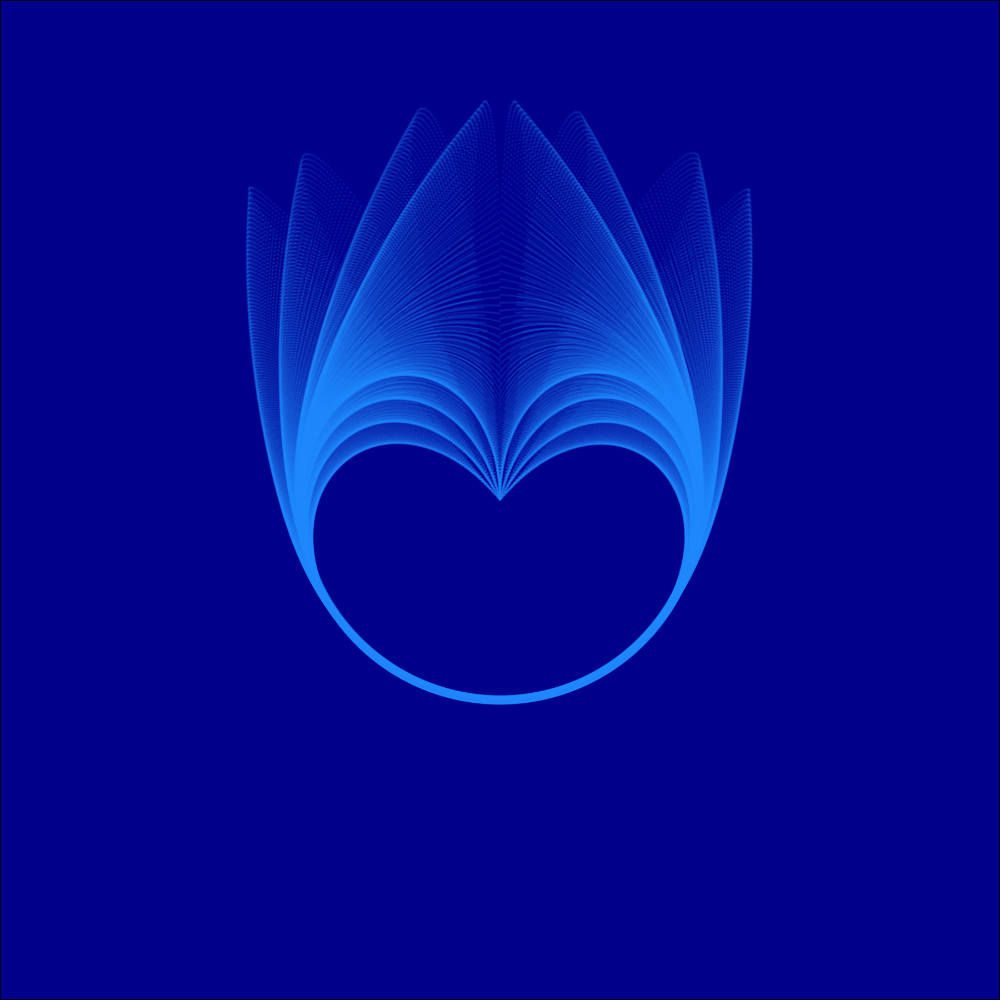

```{r setup, include=FALSE}
knitr::opts_chunk$set(echo = TRUE)
```

```{r}
library("generativeart")
```
### Setup paths
The first step in utilizing the generativeart package is to set the paths by which the image will be saved. these paths include the image directory, image subdirectory and subdirectory2, image path, logfile, logfile directory, and logfile path
```{r}
# set the paths
img_directory <- "img/"
img_subdirectory <- "everything/"
img_subdirectory2 <- "handpicked/"
IMG_PATH <- paste0(img_directory, 
                   img_subdirectory)
logfile_directory <- "logfile/"
logfile <- "logfile.csv"
LOGFILE_PATH <- paste0(logfile_directory, 
                       logfile)
```

### Functions used
The main functions utilized in generative art are the setup_directories,a formula, and  the generate_img functions.

#### setup_directories
setup_directories is a function that sets up a directory structure for image creation. The function takes in four aguments: img_path, img_subdir, img_subdir2, and logfile_dir. img_path determines the path by which the images should be saved, img_subdir establishes a subdirectory, img_subdir2 esablishes a second subdirectory, and logfile_dir establishes a logfile directory. The setup_directories function is beneficial in the sense that it establishes four subdretories within the working directory

```{r}
# create the directory structure
generativeart::setup_directories(img_directory, 
                                 img_subdirectory, 
                                 img_subdirectory2, 
                                 logfile_directory)
```

#### Formula
the next step is to set up a formula. The formula below uses the runif function which takes in the number of observations as well as the maximum and minimum distribution limits. The runif function is then multiplied by any expression which will determine the shape of the image produced.

```{r}
my_formula <- list(
  x = quote(runif(1, -1, 10) * x_i*4 + cos(y_i-7)),
  y = quote(runif(1, -1, 10) * y_i^3 - x_i^6 * sin(y_i*4))
)
```

#### generate_img
The final function used in generativeart is the generate_img function. Generate_img takes in the formula, the number of images to be created (nr_of_img), whether the art is being generaed in a polar or cartesian plane (polar = TRUE/FALSE), the filetype (filetype = png), and any other argument such as color (color = ) and background color (background_color = ).

```{r}
generativeart::generate_img(formula = my_formula, 
                            nr_of_img = 2, # set the number of iterations
                            polar = TRUE, 
                            filetype = "png", 
                            color = "dodgerblue1", 
                            background_color = "darkblue")
```

### Example

