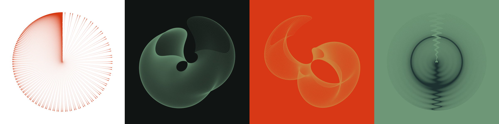
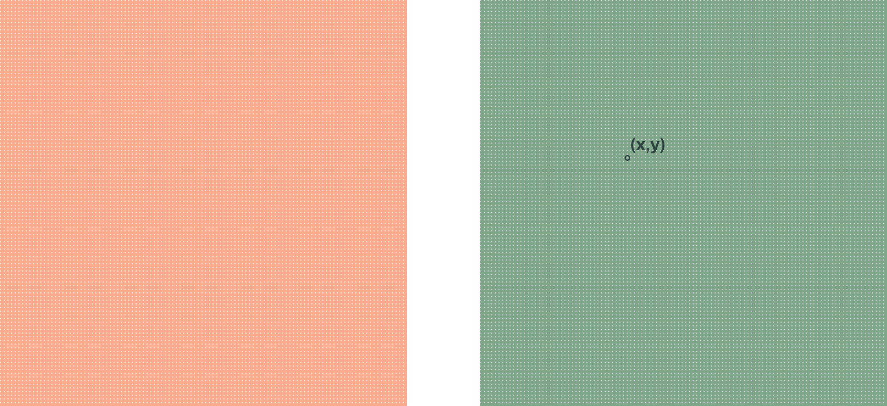
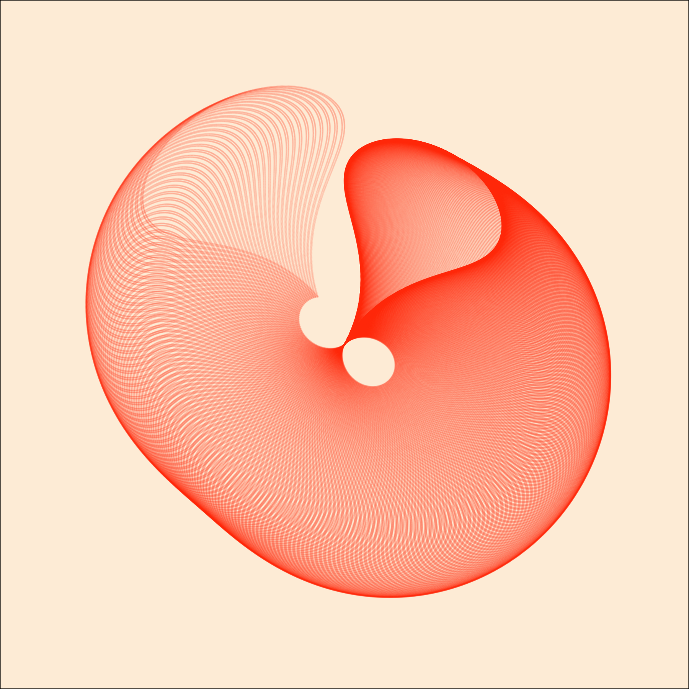
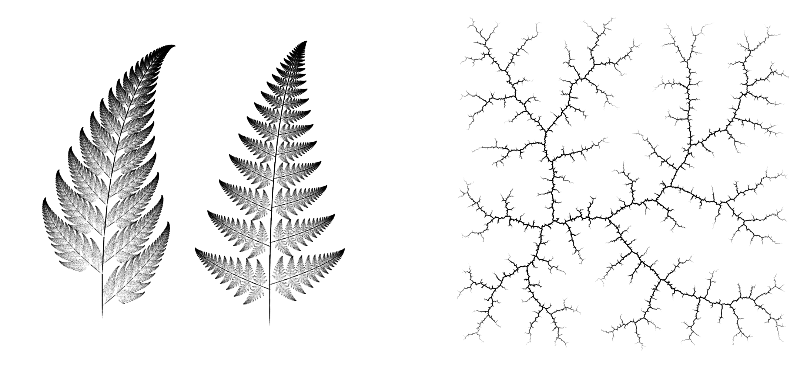

```{r setup, include=FALSE}
knitr::opts_chunk$set(echo = TRUE, message=FALSE, cache = TRUE)
```


### generativeart 



<br> 
  
#### author

The R package `generativeart` was created by Katharina Brunner, a German data analyst and software developer, to introduce human-independent randomness to creative processes. 

<br>
    
#### overview

Generative art is the intercalation of controlled randomness into artistic systems; `generativeart` simplifies autonomous system creation by packaging data initialization and visualization processes into basic hyperparameters and generative functions. 

<br>
Brunner automatizes the generation process by first creating a grid of dots within the range `seq(from = -pi, to = pi, by = 0.01) %>% expand.grid(x_i = ., y_i = .)` (the pink grid!) and assigning each point a coordinate value (the green grid).  

<br>
{width=75%}

<br>
Each point is then individually transformed by our function with randomized parameters (e.g. random uniform distribution); the visualization's randomized seed ensures each returned image will be unique. 


`generativeart` allows for easy process iteration and image replication with structured output directories and log csvs (preserving the file name, seed, and formula of all generated images in an easily accessible and readable format). 

<br>
    
#### installation

`generativeart` can be installed from github with `devtool`:  

```{r class.source="install", eval=FALSE}
devtools::install_github("cutterkom/generativeart")
```

<br>

#### dependencies 
`generativeart` uses R packages `ggplot2`, `magrittr`, `purrr`, and `dplyr` for data manipulation (`magrittr` and `dplyr`), functional programming (`purrr`), and data visualization (`ggplot2`).

<br>
  
#### functions in `generativeart`
  

```{=html}
<div>
  <button class="viz">setup_directories</button>
  <button class="viz">generate_img</button>
  <button class="gen">generate_data</button>
  <button class="gen">generate_logfile_entry</button>
  <button class="gen">generate_seeds</button>
  <button class="gen">generate_plot</button>  
  <button class="gen">generate_filename</button>
  <button class="gen">check_logfile_existence</button>
  <button class="regen">get_formula_from_logfile</button>
  <button class="regen">get_seed_from_logfile</button>
  <button class="regen" style="margin-bottom:0">regenerate_img</button>
</div>

<br>
```

<span style="color:#80A68A;font-weight:700">light green</span> functions are the most common external methods, <span style="color:#FAAA8D;font-weight:700">pink</span> functions are internal and for package functionality, <span style="color:#465249;font-weight:700">dark green</span> functions support image regeneration and are primarily external. 

<br>

### example {.tabset}

`generativeart` distills the mathematical and visual processes of generative art to a core set of 2 functions (`setup_directions`, `generate_img`) and 6 hyperparameters:

<br>

hyperparameter | inputs
------------- | -------------
`formula` | a list() of a mathematical expressions (typically *sine* and *cosine* within a random distribution)
`nr_of_img` | number of images to output
`polar` | a boolean defining a cartesian or polar coordinate system
`color` | color of grid
`background_color` | background color of grid
`filetype` | a specified output format (default = png, alternatives specified by `ggplot::ggsave()`


Brunner's process for creating generative art is to first, **set up** the specific directory structure that fits your needs best, second, **define** your hyperparameters, and third, **generate** your image.

<br> 

#### identify paths

The first step in utilizing `generativeart` is to set the paths by which the image and csv will be saved. These paths include the image directory, image sub-directories, image path, logfile, logfile directory, and logfile path.

```{r}
# set the paths
img_directory <- "img/"
img_subdirectory <- "everything/"
img_subdirectory2 <- "handpicked/"
IMG_PATH <- paste0(img_directory, 
                   img_subdirectory)
logfile_directory <- "logfile/"
logfile <- "logfile.csv"
LOGFILE_PATH <- paste0(logfile_directory, 
                       logfile)
```

```{=html}
<br>
```

#### set up directory
`setup_directories` is a function that sets up a directory structure for image creation. The function takes 4 arguments: `img_path`, `img_subdir`, `img_subdir2`, and `logfile_dir`. `img_path` isolates the path by which the images should be saved, `img_subdir` creates a sub-directory, `img_subdir2` creates a second sub-directory, and `logfile_dir` defines a logfile directory. The `setup_directories` function is beneficial in the sense that it allows us to have structural control while providing for easy image and log file access. 

```{r, eval=FALSE}
# create the directory structure
generativeart::setup_directories(img_directory, 
                                 img_subdirectory, 
                                 img_subdirectory2, 
                                 logfile_directory)
```
 
```{=html}
<br>
```

#### define first hyperparam

The next step is to set up our formula. The equation system below uses the `runif` function, which returns a random distribution parameterized by the number of observations `n` and the upper and lower distribution limits (`min`, `max`). The random distribution acts as a multiplier for our expression which, in conjunction with the defined coordinate plane, will determine the shape of the image produced. This numerical randomization assures visual randomization.

```{r}
# include a specific formula, for example:
my_formula <- list(
    x = quote(x_i^2 - runif(1, -1, 1)*sin(y_i^1)),
    y = quote(runif(1, -1, 1) * y_i^2 - cos(x_i^2))
)
```

```{=html}
<br>
```

#### generate image

The final function used in `generativeart` is the `generate_img` function. `generate_img` takes in the formula, the number of images to be created (`nr_of_img`), whether the art is being generated in a polar or cartesian plane (`polar = TRUE/FALSE`), the filetype (`filetype = png`), and any other argument such as color (`color =` ) and background color (`background_color = `).

```{r, eval=FALSE}
generativeart::generate_img(formula = my_formula, 
                            nr_of_img = 1, # number of iterations
                            polar = TRUE, # polar coordinate plane
                            filetype = "png",
                            color = "#FF4000", 
                            background_color = "#FEEFDD")
```

{width=50%}

```{=html}
<br>
```

### summary

```{=html}
<br>
```

#### similar packages {.tabset}

Generative art has been around since the term was coined in the 1960s, and over the years the creative process has had implementations across different languages and packages. 

In R, two packages of note are: 

* [jasmines](https://github.com/djnavarro/jasmines)
* [mathart](https://github.com/marcusvolz/mathart)

```{=html}
<br>
```

##### jasmines

`jasmines` is a generative art R package created by Danielle Navarro, the author of the *Learning Statistics with R*. Focused on simulation parameters, (`grain`, `interaction`), shapes (`entity_circle`, `scene_discs`), stylistic modifications (`style_ribbon`, `palette`, `alpha`), and noise, `jasmines` allows for iterative play on generative hyperparameters. 

<br>

similarities | differences
------------- | -------------
reproducibility and regeneration capabilities (`jasmines`'s `use_seed()` functionality can be simulated with `generativeart`'s `get_seed_from_logfile` and `regenerate_img`) | `ambient` library integration, allowing for greater color manipulation
`ggplot` backbone | `dplyr` pipeline functionality 
easy hyperparameter tuning | `jasmines` iterates on 1 image by a specified number of times, `generativeart` transforms a dot grid once
accessible documentation | `generativeart` stores a log file of generated images and their respective hyperparams, a functionality not accesible in `jasmines` 


```{=html}
<br>
```

##### mathart

`mathart` is a generative art R package created by Marcus Volz, an artist who works with mathematical principles and data viz. `mathart` provides data and R methods for creating specific fields of mathematical art, from fractal ferns and k-d trees to Lissajous curves and k-nearest neighbor graphs. With less of a focused on randomized individuality than `generativeart`, `mathart` allows for the exploration of renowned (and super cool) parametric equations. 



`mathart` is targeted to those with a strong mathematical background and have been exposed to mathematical structures like rapidly_exploring_random_trees or Weiszfeld's algorithm (geometric median of a given set of points). `generativeart` offers comparatively limited mathematical functionality (as is primarily based on sine and cosine functions) with a heavy basis on polar coordinates to create the spherical design.  

*functionality sidenote: `mathart` is dependent on the `ggart`() package, which is currently unavailable to users.*

```{=html}
<br>
```

#### reflection

Generative art is a highly advanced algorithmic field that allows for creative expression and for art generation that would otherwise be difficult to reproduce manually; ready-to-use R packages like `generativeart` aid artists in this creative process. 

<br>

package pros | package cons
------------- | -------------
extensive documentation and ease of use  | limited mathematical functionality (sine and cosine functions primarily), causing a reliance on messing around with coordinate systems (cartesian/polar) to achieve desired viz  
reproducibility | generative art is a dramatically advancing field! the package could very well be rendered useless within a few years
ability to select cartesian and polar coordinate systems by setting `polar = TRUE` or `polar = FALSE` | limited (see: nonexistent) gradient manipulation 
low computational cost by using R lists over matrices | high computational cost possibly associated with mathematically complex expressions 

<br>

To advance this package, we'd like to see improved mathematical functionality (similar to `mathart`) and more accessible and malleable color palettes (gradients, shading, etc.). Overall, the team really enjoyed researching this package and its ability to make complex art. We found it to be an incredibly useful (and super cool) package to work with!

<br>

#### sources

[generativeart documentation](https://github.com/cutterkom/generativeart/blob/master/R/setup_directories.R)  
[jasmines documentation](https://github.com/djnavarro/jasmines)  
[mathart documentation](https://github.com/marcusvolz/mathart)  
[getting started with generative art in R](https://vitgabrhel.medium.com/getting-started-with-generative-art-in-r-3bc50067d34b)
[experiments in R](https://fronkonstin.com/)  
[Katharina Brunner's portfolio](https://katharinabrunner.de/generativeart/)  
[why love generative art?](https://www.artnome.com/news/2018/8/8/why-love-generative-art)  


